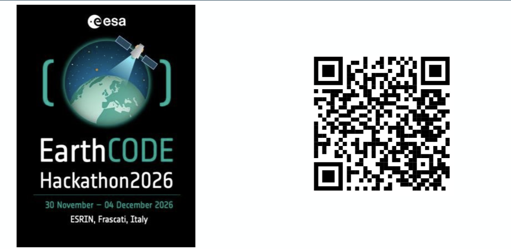

# Keep Going With EarthCODE

Continue exploring EarthCODE after the workshop:

[Visit EarthCODE](https://earthcode.esa.int)

## EarthCODE Hackathon 2026

Be on the lookout for the first EarthCODE Hackathon, hosted at ESA-ESRIN from **30 November to 4 December 2026**.

The hackathon will bring together Earth system scientists, ESA Science Cluster teams, FAIR data and workflow specialists, and open source geospatial developers to work on reusable, analysis-ready Earth observation data collections.

Registration will open in **July/Aug 2026**. Keep an eye on the official page for registration details and updates.

[Follow the EarthCODE Hackathon 2026 page](https://earthcode.esa.int/blog/Hackathon-2026)
